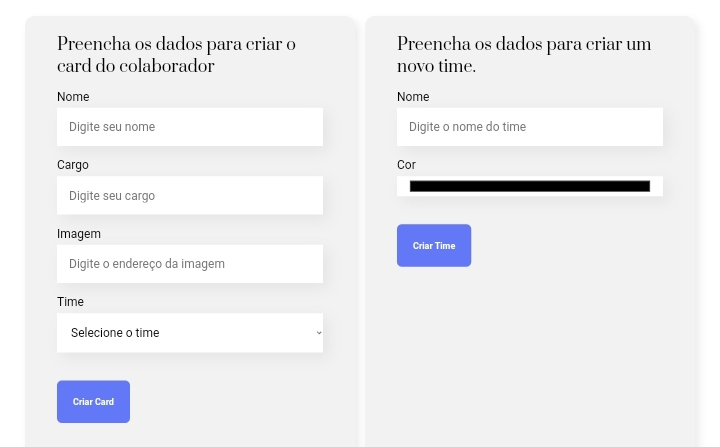

 <h2 align="center">Organo</h2>

Desenvolvido durante maio/junho de 2024 com foco em fortalecer as habilidades de React e gerenciamento de estado 🚀⚡.  

- [Visão geral](#visão-geral)
  - [Sobre o projeto](#sobre-o-projeto)
  - [Screenshots](#screenshots)
  - [Links](#links)
- [Meu processo](#meu-processo)
  - [Tecnologias](#tecnologias)
  - [Funcionalidades](#funcionalidades)
  - [Continuar o desenvolvimento](#continuar-o-desenvolvimento)
  - [Recursos úteis](#recursos-úteis)
- [Autor ](#autor)

 

## Visão geral
### Sobre o projeto
Organo é um site onde se pode criar e organizar equipes de tecnologia. Os usuários podem adicionar times como Front-end, Back-end, Data Science, etc., escolher uma paleta de cores 🎨 para cada time, e adicionar membros às equipes. O projeto foi desenvolvido para praticar conceitos de React, gerenciamento de estado, e manipulação de dados dinâmicos.

### Screenshots

  

  

### Links
- [Acesse o projeto finalizado, online ☁️](https://organo-tech.vercel.app/)
- [Acesse o figma do projeto 🖼️](https://www.figma.com/file/T6BLI1HfB81eYOiVgpqQz7/Projeto-Intro-ao-React?node-id=134%3A128)

 

## Meu processo
### Tecnologias
Esse projeto foi desenvolvido com as seguintes tecnologias:

- React (Create React App)
- CSS para estilização
- uuid para geração de IDs únicos
- hex-to-rgb para manipulação de cores
- Git e Github para versionamento

### Funcionalidades
- Criação e organização de times de tecnologia
- Adição de membros aos times
- Escolha de paleta de cores para cada time
- Exclusão de membros dos times
- Funcionalidade de "favoritar" membros

### Continuar o desenvolvimento
Futuras melhorias:
- Implementação de um backend para persistência de dados
- Adição de funcionalidades de edição de times/membros
- Implementação de um modo dark/light
- Expansão das opções de personalização dos times

### Recursos úteis
- [Documentação do React](https://reactjs.org/docs/getting-started.html) - Guia oficial para aprender e utilizar React.
- [UUID NPM package](https://www.npmjs.com/package/uuid) - Documentação da biblioteca uuid para geração de IDs únicos.
- [hex-to-rgba NPM package](https://www.npmjs.com/package/hex-to-rgba) - Documentação da biblioteca hex-to-rgb para manipulação de cores.

 

## Autor
*JoãoAlisonTI 👨🏽‍💻*

---

<strong>2024</strong>